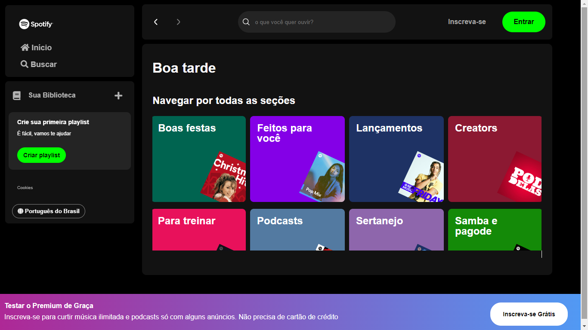
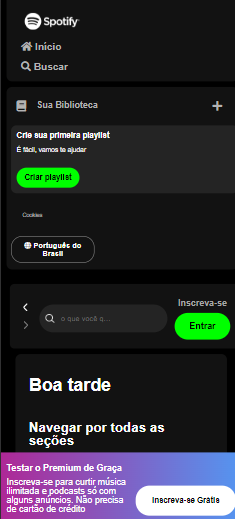

# Imersão Alura Front-End


## Descrição

Esta foi a Imersão Front-end Alura, com o objetivo de ensinar novas pessoas que estão entrando no mundo da programação.
O projeto foi feito em HTML, CSS, Javascript

### Projeto Spotify



Ainda fiz a responsividade




## Funcionamento


- **Instale o JSON Server:**
Instale o json-server globalmente, se ainda não o fez

    ```
    npm install -g json-server"
    ```

- **Inicie o servidor usando o comando:**

    ```
    json-server --watch nome-da-pasta-caso-tenha/artists.json --port 3000
    ```

- **Atualização do JSON Server:** 
Certifique-se de ter a versão mais recente do json-server instalada. Você pode atualizar usando o seguinte comando:

    ```
    npm install -g json-server@latest
    ```


### Autor do Readme:

[](https://github.com/vittorioaugusto) | [Vittorio Augusto](https://github.com/vittorioaugusto)
| --- | --- |


[certificado](../../../Certificados/certificado_imersão_alura.pdf)

